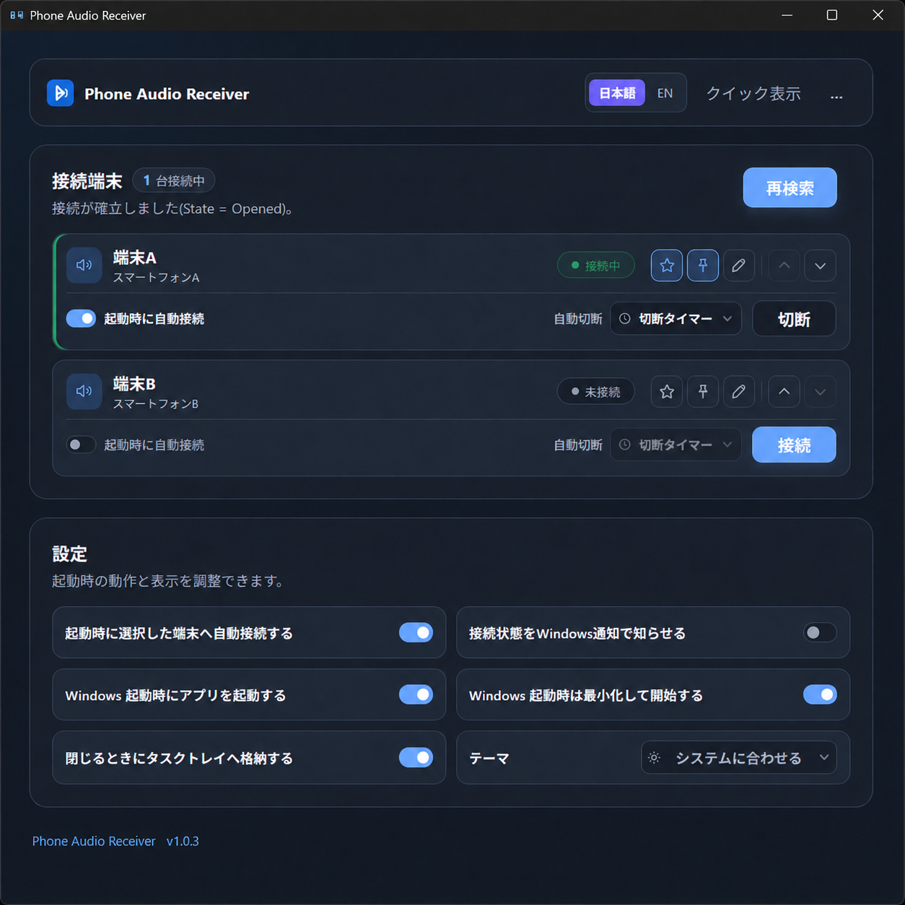
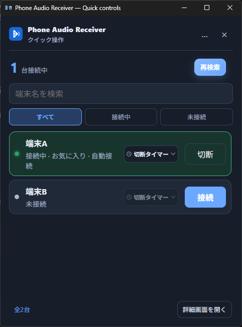

# Phone Audio Receiver

スマートフォンのBluetooth音声をWindows PCで受信し、Windowsの既定の再生デバイスから再生するアプリです。

Phone Audio Receiver turns a Windows PC into a Bluetooth audio receiver for paired smartphones. The application UI supports Japanese and English.

> バージョン1.0.3では、2台のスマートフォンによる同時接続と個別切断を実機確認済みです。アプリ内に台数制限はありませんが、3台以上の同時接続は未検証で、Bluetoothアダプターやドライバーに依存します。

## スクリーンショット

### 通常画面



### クイック操作



## ダウンロード

最新版は[GitHub Releases](https://github.com/mouiron/phone-audio-receiver/releases/latest)からダウンロードできます。

zipを展開し、`Phone Audio Receiver.exe`を実行してください。現在の配布バイナリはコード署名されていないため、初回実行時にMicrosoft Defender SmartScreenの警告が表示される場合があります。ダウンロード元とReleaseに記載されたSHA-256を確認し、信頼できる場合にだけ実行してください。

## 主な機能

- ペアリング済みスマートフォンのBluetooth音声をPCで再生
- 複数端末の個別接続・個別切断
- タスクトレイから最大6台を個別操作
- 全端末を検索・絞り込みできるクイック操作画面
- 通常画面とクイック操作画面の切り替えと、閉じた画面種別の常駐中保持
- 端末ごとの表示名、お気に入り、トレイ固定、表示順の保存
- 端末ごとの15分、30分、1時間、2時間の切断タイマー
- 選択した端末への起動時自動接続
- Windowsログオン時の自動起動
- 初回起動時はWindowsの優先表示言語に応じ、画面上の選択を次回起動後も保持する日本語・英語表示
- キーボード操作とWindowsのモーション設定に配慮した表示
- セットアップ診断と手動アップデート確認
- 問題報告に使用できる匿名化済みログ

音声はWindows標準の`AudioPlaybackConnection`を使用し、Windowsの既定の再生デバイスへ出力します。仮想オーディオドライバーや音声制御用の子プロセスは使用しません。

## 動作環境

- 64bit版Windows 10 バージョン2004以降、またはWindows 11
- Bluetooth機能
- 音声再生に対応した、Windowsとペアリング済みのスマートフォン
- Microsoft Edge WebView2 Runtime

通常のWindows 10/11にはWebView2 Runtimeが導入されています。画面が表示されない場合は、[Microsoft公式サイト](https://developer.microsoft.com/microsoft-edge/webview2/)から導入してください。

## 使い方

1. WindowsのBluetooth設定でスマートフォンをペアリングします。
2. Phone Audio Receiverを起動します。
3. **再検索**を押します。
4. 表示された端末の**接続**を押します。
5. スマートフォンで音声を再生します。

既定では、ウィンドウを閉じてもアプリは終了せず、タスクトレイへ格納されます。完全に終了する場合は、タスクトレイアイコンを右クリックして**終了**を選択してください。

タスクトレイを左クリックすると、最後に閉じた通常画面またはクイック操作画面が復帰します。右クリックメニューには、トレイ固定、接続中・接続処理中、お気に入り、その他の端末の順で最大6台を表示し、各グループ内では設定した表示順を維持します。端末ごとに接続・切断でき、7台以上見つかった場合は、**その他の端末…**から全端末を扱えるクイック操作画面を開けます。

## 端末カードの操作

- 星: お気に入りに設定し、タスクトレイで優先的に表示します。
- ピン: タスクトレイの先頭グループへ固定します。
- 鉛筆: Windows上の名前を変えず、アプリ内だけの表示名を設定します。
- 上下矢印: 通常画面、クイック操作画面、タスクトレイで共通の表示順を変更します。
- 時計: 接続中の端末へ切断タイマーを設定します。
- `…`: 操作方法、セットアップ診断、アプリログ、手動アップデート確認を開きます。

接続、切断、切断タイマーは表示名や画面上の位置ではなく、対象端末のBluetoothデバイスIDに対して実行します。アイコンとキーボード操作の一覧は、アプリ内の「…」→「操作方法」からも確認できます。

## 切断タイマー

接続中の端末ごとに、15分、30分、1時間、2時間後の切断タイマーを設定できます。タイマーはアプリの実行中だけ保持し、期限の1分前にWindows通知を表示します。期限到達時は対象端末だけを切断し、別の接続中端末には作用しません。

現在は時間基準のタイマーであり、スマートフォンから音声を受信しているかどうかは判定しません。

## キーボード操作

- `F5`: 端末を再検索
- `Alt+Q`: 通常画面とクイック操作画面を切り替え
- クイック操作画面の`Ctrl+F`: 端末検索欄へ移動
- `Esc`: 開いているメニュー、ダイアログ、またはクイック操作画面を閉じる
- `Tab`／`Shift+Tab`: 操作項目を順方向／逆方向へ移動

## 手動アップデート確認

「…」→「アップデートを確認」を選んだ場合だけGitHub Releases APIへ接続し、現在のバージョンと最新版を比較します。起動時やバックグラウンドでは確認せず、テレメトリも送信しません。

## 既知の制約

- 出力先はWindowsの既定の再生デバイスです。アプリから出力先を個別指定できません。
- 端末ごとの音量・ミュート操作はできません。Windowsの音量ミキサーまたはスマートフォン側で調整してください。
- スマートフォン側やWindowsのBluetooth側から切断した場合、画面が「接続中」のままになることがあります。対象端末の**切断**を押して管理状態を解除し、改めて**接続**してください。
- 外部切断後の自動再接続は、Windows APIによる状態誤判定を避けるため意図的に提供していません。起動時の自動接続は別機能です。
- Bluetoothの同時接続可能台数と安定性は、Bluetoothアダプター、ドライバー、Windows、端末側の実装に依存します。

詳細は[KNOWN_ISSUES.md](KNOWN_ISSUES.md)を参照してください。

## プライバシーと問題報告

アプリはテレメトリを収集せず、アプリから外部へログを送信しません。ログはローカルに保存されます。生ログには端末名、完全なBluetoothデバイスID、ユーザーフォルダーが含まれる場合があるため、公開Issueへ添付しないでください。

問題報告には、アプリの**匿名化済みログをコピー**で取得した内容を使用してください。このREADMEのスクリーンショットも、端末名を`端末A`、`端末B`などのサンプル表記へ置き換えています。詳細は[PRIVACY.md](PRIVACY.md)を参照してください。

## 開発

必要な環境：

- Windows
- Node.js 22以降
- Rust stable（MSVCツールチェーン）
- Microsoft Edge WebView2 Runtime

```powershell
npm install
npm run tauri:dev
```

検証：

```powershell
npm run frontend:build
cargo fmt --all -- --check
cargo test --workspace --locked
```

依存関係を追加・更新した場合と配布前には、次を実行します。

```powershell
.\tools\security_check.ps1
```

開発上の不変条件と手動回帰確認は[CONTRIBUTING.md](CONTRIBUTING.md)を参照してください。

## 構成

- `web/` — Tauriフロントエンド
- `src-tauri/` — TauriバックエンドとWindows統合
- `core/` — Bluetooth接続、設定、国際化のRustロジック
- `tools/` — セキュリティ確認、releaseビルド、配布物作成

## ライセンス

著作者: `mouiron`

このプロジェクトは[MIT License](LICENSE)で公開されています。配布バイナリが利用するサードパーティーソフトウェアのライセンスは、Releaseの配布物に含まれる`THIRD_PARTY_NOTICES.md`と`THIRD_PARTY_LICENSES.txt`を参照してください。
